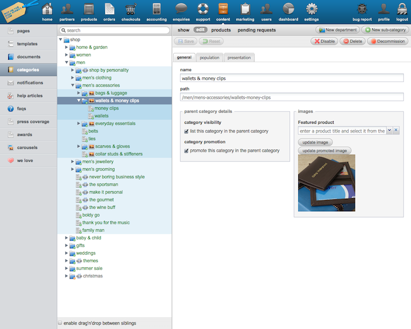

!SLIDE 
# ExtJS Intro #
## Roland Swingler ##
## @knaveofdiamonds ##

!SLIDE center

!SLIDE center

!SLIDE center

!SLIDE
# Containers & Layouts #

!SLIDE
    
    @@@ javascript
    new Ext.Viewport({
      layout: 'border',
      renderTo: Ext.getBody(),
      items: [...]
    });

!SLIDE

    @@@ javascript
    items: [{
      region: 'north',
      items: [...]
    },{
      region: 'east',
      split: true,
      width: 200,
      html: "East is east"
    },{
      region: 'center'
      ...

!SLIDE

    @@@ javascript
    layout: 'border'

    // Is the same thing as

    layout: new Ext.layout.BorderLayout();

!SLIDE
# Data Stores #

!SLIDE

    @@@ javascript
    function populate_some_ui_widget() {
      // jQuery
      $.get('/some/data/maybe/json',
        function(data) { 
          // Great! parse the data and do
          // DOM manipulation.
        }
      });
    }

!SLIDE

    @@@ ruby
    # ActiveRecord In some controller
    def edit
      @product = Product.find(13)
    end

!SLIDE
# Proxy #
# Reader / Writer #
# Store #

!SLIDE
data store example...

!SLIDE

    @@@javascript
    new Ext.data.MemoryProxy( js_obj );

    new Ext.data.HttpProxy( http_connection );

!SLIDE bullets
# Bad things #

* License issues
* Testing
* No-MVC concept
* HTML it produces is _ugly_
* Can be slow with lots of data

!SLIDE bullets
# Good things #

* <s>CSS Tomfoolery</s>
* Fast to develop with
* Frequent releases

!SLIDE
# Questions? #
